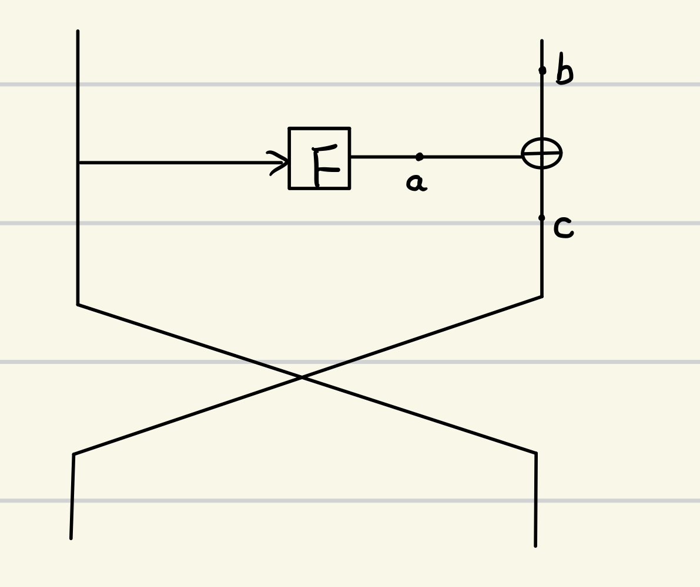

 <font face='黑体' color='red' size=4>关键字</font>：结合不变差分比特的建模方法，自动搜索所需能成功攻击的不可能差分迹

## 1. 过去对SIMON的不可能差分攻击的错误之处

当密钥的扩散性太强时，不能用密钥比特的概念来计算剩余密钥及攻击复杂度，如$k_{in}\rightarrow ID \leftarrow k_{out}$ ，当密钥的**扩散性**太强时，$k_{in}$ 和 $k_{out}$ 的密钥比特之间的关系往往非常复杂，很难同时通过 $k_{in}$ 和 $k_{out}$ 的表达式关系将剩余密钥计算出来。这时，只能猜测$k_{in}$ 或 $k_{out}$ ，而将剩余密钥看成是随机数。

​假设猜测密钥经过不可能差分攻击后，每个密钥剩余的概率为 $p$ 。此时将$k_{in}$ 作为被猜测的密钥，则 $k_{in}$ 中剩余密钥的个数为：$(1-p\times 2^{k_{out}})\times 2^{k_{in}}$ 。穷搜的密钥个数为：$(1-p\times 2^{k_{out}})\times 2^{k_{in}}\times 2^{N-k_{in}}$ ，其中 $N$ 为密钥比特总数。 

**多重集合的重复筛选**：对于重复出现了m次的元素，被筛选后留下的概率为p，则该元素被留下的概率：
$$
1-(1-p)^{m}
$$

​假设猜测密钥经过不可能差分攻击后，每个密钥剩余的概率为p。前面的扩展轮的被猜测的密钥比特个数为$k_{in}$ ，后面的扩展轮的被猜测的密钥比特个数为 $k_{out}$ 。经过筛选之后剩余的前面的扩展轮的被猜测密钥的个数为：
$$
m=(1-(1-p)^{2^{k_{out}}})\times 2^{k_{in}}
$$
穷搜的密钥个数为：$m\times 2^{N-k_{out}}=(1-(1-p)^{2^{k_{out}}})\times 2^{N}$ ，其中N为密钥比特的总数。

## 2. 与操作的性质 

​有一个与操作：$z=x\cdot y$ ，假设该操作的输入和输出差分分别为：$\Delta x,~\Delta y,~\Delta z$ 。一对明文中的其中一个分别是：$x,y,z$ 。则有如下的关系：
$$
\begin{aligned}
 \Delta z &=(\Delta x+ x)(\Delta y+ y)+x\cdot y \\
          &=\Delta x\cdot \Delta y+\Delta x \cdot y +\Delta y \cdot x +x\cdot y+x\cdot y \\
          &=\Delta x\cdot \Delta y+\Delta x\cdot y+\Delta y x
\end{aligned}
$$
对于该操作来说，当其中的一个比特的差分为1时，则影响到另一个比特的明文的密钥都会involved。

## 3.不可能差分攻击

### 3.1 两种轮密钥加的密码算法结构的攻击过程：

$$filter~(c_{0})\rightarrow key~(k_{0})\rightarrow filter~(c_{1})\rightarrow key~(k_{1})\rightarrow ID \leftarrow filter~(c_{2})\leftarrow key(k_{2})\leftarrow filter(c_{3})\leftarrow key(k_{3})$$
$$key(k_{0})\rightarrow filter(c_{0})\rightarrow key(k_{1})\rightarrow filter(c_{1})\rightarrow ID \leftarrow key(k_{2})\leftarrow filter(c_{2}) \leftarrow key(k_{3}) \leftarrow filter_(c_{3})$$

这两种密码算法结构都可归纳于以下的过程：$key_(k_{0})\rightarrow filter_(c_{0})\rightarrow ID \leftarrow filter(c_{1})\leftarrow key_(k_{1})$

所以攻击所需的时间复杂度为：
$$
T=Nk_{0}+\frac{N\times k_{0} \times k_{1}}{c_{0}}
$$
　　在计算时间复杂度的时候，加 key 操作所需的时间可忽略，因为其总是与其后的 filter 相连，故只考虑 filter 操作的时间即可。

### 3.2 不可能差分攻击的明密文对的构建过程

1. 给定m个明文，经过m次加密，输出m个密文。
2. 假设攻击所需的密文的差分模式为 ??101?11 ，建立一个hash表，index范围 0~$(2^{5}-1)$ ，将输出密文对应的非自由比特的值对应到index上，于是每个index下存储的所有的自由组合成为了所需的密文对。所需的存储为hash表的大小，也就是所需明文个数。

## 4. 攻击的三种方式

### **攻击的三种方法：**

1. 对每一对明密文对，测试所有密钥。

2. 对每一个密钥，测试所有明密文对。

3. 利用新的存储方式。

假如已给定不可能差分，且不可能差分攻击下的参数如下所示，前后向分别为 $r_{in},r_{out}$ 轮：

$$\Delta_{X_{0}}\xrightarrow[R_{0}]{(c_{in}^{0},k_{in}^{0})} \cdots \Delta_{X_{r_{in}-1}}\xrightarrow[R_{r_{in}-1}]{(c_{in}^{r_{in}-1},k_{in}^{r_{in}-1})} ID \xleftarrow[R_{r_{out}-1}]{(c_{out}^{r_{out}-1},k_{out}^{r_{out}-1})}\Delta_{Y_{r_{out}-1}} \cdots \xleftarrow[R_{0}]{(c_{out}^{0},k_{out}^{0})}\Delta_{Y_{0}}$$

输入明密文对个数为 $N$, 其中 $c_{i}$ 表示该轮的给定输入差分集合传播到输出差分集合的概率 $p_{i}=2^{c_{i}}$ ，$k_{i}$ 表示该轮所需猜测的密钥比特数，总共需要猜测 $2^{k_{i}}$ 个密钥，且测试顺序先前向轮，再后向轮。


### 1. 对每一对明密文对，测试所有密钥（先加密钥，后筛选）


- 第一对明文：

1. 第一轮：计算 $2^{k_{in}^{0}}$ 次，剩余的明文对个数为 $\frac{2^{k_{in}^{0}}}{2^{c_{in}^{0}}}$ 。

2. 第二轮：计算 $\frac{2^{k_{in}^{0}}}{2^{c_{in}^{0}}} \times 2^{k_{in}^{1}}$ 次，剩余的明文对个数为 $\frac{2^{k_{in}^{0}+k_{in}^{1}}}{2^{c_{in}^{0}+c_{in}^{1}}}$ 。

3. 最后一轮：计算 $\frac{2^{k_{in}^{0}+k_{in}^{1}+,\cdots,+k_{in}^{r_{in}-1}+k_{out}^{0}+k_{out}^{1}+,\cdots,+k_{out}^{r_{out}-1}}}{2^{c_{in}^{0}+,\cdots,+c_{in}^{r_{in}-1}+c_{out}^{0}+,\cdots,+c_{out}^{r_{out}-1}}}\times 2^{c_{out}^{r_{out}-1}}$ 次。（如果最后一轮是$ID\xrightarrow{}\Delta_{Y_{r_{out-1}}}$ ，该轮的攻击时间复杂度为：）


### 两种不同的筛选方式
以如下的简单的不可能差分攻击为例，其中已经选择的明密文对数为 $N$：
$$
\Delta X_{0} \xrightarrow[R_{0}]{(c_{0},k_{0})} \Delta X_{1}  \xrightarrow[R_{1}]{(c_{1},k_{1})}ID \xleftarrow[R_{3}]{c_{3},k_{3}} \Delta Y_{1} \xleftarrow[R_{2}]{c_{2},k_{2}} \Delta Y_{0}
$$

**对每一个密钥，测试所有的明密文对**

1. 令 $k_{0}=k_{0}^{1}$ ，则此时加密 $N$ 次，剩余的明文对数为 $\frac{N}{2^{c_{0}}}$ 。\
   令 $k_{1}=k_{1}^{1}$ ，则此时加密 $\frac{N}{2^{c_{0}}}$ 次，剩余的明文对数为 $\frac{N}{2^{c_{0}+c_{1}}}$ 。 \
   令 $k_{2}=k_{2}^{1}$ ，则此时加密 $\frac{N}{2^{c_{0}+c_{1}}}$ 次，剩余的明文对数为 $\frac{N}{2^{c_{0}+c_{1}+c_{2}}}$ 。\
   令 $k_{3}=k_{3}^{1}$ ，则此时加密 $x$ 次，$x$ 的值取决于几次之后就可以排除掉错误密钥。 

当$k_{0}||k_{1}||k_{2}||k_{3}$的值每变换一次，则 $R_{3}$ 需要运行 $x$ 次，所以最后一轮共需加密 $2^{k_{0}+k_{1}+k_{2}+k_{3}}\times x$ 次。 \
当$k_{0}||k_{1}$的值每变换一次，则 $k_{2}$ 需要遍历一次，所以 $R_{2}$ 的加密次数为$2^{k_{0}+k_{1}+k_{2}}\times \frac{N}{2^{c_{0}+c_{1}}}$ \
其他的同理，共需的时间复杂度为：
$$
T=2^{k_{0}}\times N +2^{k_{0}+k_{1}} \times \frac{N}{2^{c_{0}}}+ 2^{k_{0}+k_{1}+k_{2}}\times \frac{N}{2^{c_{0}+c_{1}}} + 2^{k_{0}+k_{1}+k_{2}+k_{3}}\times x
$$
所需的存储复杂度为存储明密文对：$N$ 。

2. 如果一对对地测试，即测试完第一对明密文后确定该密钥是否可行，时间复杂度为：
$$
2^{k_{0}+k_{1}+k_{2}+k_{3}}\times (N'+\frac{N'}{2^{c_{0}}}+\frac{N'}{2^{c_{0}+c_{1}}}+\frac{N'}{2^{c_{0}+c_{1}+c_{2}}})
$$
其中 $N'=2^{c_{0}+c_{1}+c_{2}+c_{3}}$  

> 有问题
> 如果不限制明文对的数量，则平均值为 $N'$ ,而事实上，有一部分不能测出来的密钥所经理的明密文对的个数是有上限的，所以实际值要比这个值偏小的。

**对每一对明文，测试所有密钥**

第一对明文 $m^{0}$: 

1. 加密 $2^{k_{0}}$ 次，剩余 $\frac{2^{k_{0}}}{2^{c_{0}}}$ 对。
2. 加密 $\frac{k_{0}+k_{1}}{2^{c_{0}}}$ 次，剩余 $\frac{2^{k_{0}+k_{1}}}{2^{c_{0}+c_{1}}}$ 对。
   
第一对密文 $c^{0}$:

1. 加密 $k_{3}$ 次，剩余 $\frac{2^{k_{3}}}{2^{c_{2}}}$ 对。
2. 加密 $\frac{2^{k_{2}+k_{3}}}{2^{c_{2}}}$，剩余 $\frac{2^{k_{2}k_{3}}}{2^{c_{2}+c_{3}}}$ 对。

`前半部分`以key为index，存储明文对，平均一个key下存储 $\frac{N}{2^{c_{0}+c_{1}}}$对。\
`后半部分`以明文对为index，存储key，平均一个index下存储 $\frac{2^{k_{2}+k_{3}}}{2^{c_{2}+c_{3}}}$ 个密钥。 

**攻击时**, 假设我们已经得到了两部分的存储，在穷搜剩余密钥的时候，首先读取前半部分一个key下的所有的明文对，然后再读取后半部分所有明文对所对应的key，然后将这些key为index建立一个表，如果读到，则该表中的值为1，否则为0。然后在依次遍历该表即可。

时间复杂度为两部分：建表和读表
$$
T_{1}=N(2^{k_{0}}+\frac{2^{k_{0}+k_{1}}}{2^{c_{0}}}+2^{k_{2}}+\frac{2^{k_{2}+k_{3}}}{2^{c_{2}}})
$$
$$
T_{2}=2^{k_{0}+k_{1}}\times \frac{N}{2^{c_{0}+c_{1}}}\times \frac{2^{k_{2}+k_{3}}}{2^{c_{2}+c_{3}}}
$$
存储复杂度，三部分：前后两部分的表以及以key为index建立的一个读取表
$$
Memory=\frac{2^{k_{0}+k_{1}}}{2^{c_{0}+c_{1}}}\times N+\frac{2^{k_{2}+k_{3}}}{2^{c_{2}+c_{3}}} \times N +2^{k_{2}+k_{3}}
$$

**取得合格的明密文对的过程**

1. 首先选取一个structure，然后以密文中fix部分为index，存储对应的明文-密文
2. 通过组合一个index下的明文-密文，得到合格的明文-密文差分对
3. 然后选取第二个structure，重复上述步骤，直至所有的structure都完成

如：(m0,c0)(m1,c1)(m2,c2)可以组成3对明密文差分(m0,c0)(m1,c1), (m0,c0)(m2,c2), (m1,c1)(m2,c2)。

## 5. 对CLEFIA-128的攻击

>Property 1：对于任意的n比特的S盒，给定任意一组输入输出差分对$(\Delta X,\Delta Y)$，那么输入差分能传播到输出差分的概率$P_{r}(\Delta X\rightarrow \Delta Y)\geq 2^{-(n-1)}$。  

>Proposition 1: 给定一个Feistel轮函数 $f$ 和两个差分集合 $(\delta_{in},\delta_{out})$ ,并且有$\delta_{in}=f^{-1}(\delta_{out})$,即$\delta_{in}$是所有$\delta_{out}$经过逆向f函数之后的所有可能的差分集合。我们选择了$n$对明文(密文)对，并且这些明文(密文)对的差分都属于$\delta_{in}$。有这样的两个Feistel轮函数$f_{1}=g(s(x)\oplus k)$和$f_{2}=g(s(x\oplus k))$，其中$s(x)$表示非线性部分的操作，$g(x)$表示线性部分。我们要筛选出当输入差分属于$\delta_{in}$，输出差分属于$\delta_{out}$的明文(密文)集合，那么在不考虑密钥的情形下我们可以对候选的n对明文(密文)对预筛选，那么剩余的明文（密文）对的个数分别为：
$$
n_{1}=n\times (p_{s}) \\
n_{2}=n\times \frac{|f_{2}(\delta_{in})|}{|\delta_{out}|}
$$
其中$p_{s}$是任意一个输入差分经过非线性层能传播到线性层的概率，其中$g(\delta _{in})$表示所有输入差分经过$f_{2}$函数后的所有可能的输出差分的集合。

同时利用7条不可能差分，如下图所示：

   
首先选择 $2^{43.9}$ 个形如 $caaa ?aaa ???? ????$ 的structure，每一个structure有 $2^{72}$ 个明文，每一个structure能够构造 $2^{72\times 2-1}\times 2^{-24}$个明密文对。总共能够构造 $2^{162.9}$对明密文对，经过不可能差分输出差分的筛选，剩余的可用的明密文对的个数为 $2^{82.9}$。  

构造这些明密文对所需要的明文个数为：$2^{43.9}\times 2^{72}=2^{115.9}$ 。

攻击步骤：  
1. 将这样的一组明文$cccc~?ccc~????~????$记作一个structure，其中$c$表示该位置的值为常数，$?$表示该位置的值取遍所有的可能的值，一个structure总共有$2^{72}$个明文。我们总共需要$2^{43.9}$个structure，这些structure的第一个字节的值是常数，共需要$2^{115.9}$个选择明文。 
    
2. 对于每一个structure，根据第一组不可能差分的输出差分为index，建立3个HASH表来生成所需要的明文(密文)对，每个HASH表的大小为 $2^{72}$, 然后每个HASH表生成 $2^{72\times 2 -1-80}=2^{63}$个明文(密文）对，将这些明文(密文)对经过预筛选，剩余$2^{63-24-10}=2^{29}$对明文(密文)对。遍历完所有的structure所需要的存储为:
$$
m_{1}=(2^{29+43.9}+2^{72})\times 3\times 2=2^{76.1}~blocks
$$   

3. 依次遍历所有的structure，遍历时以第6个字节的所有$2^{8}$个所有可能的取值为一组，根据第二组不可能差分的输出差分，将这一组明文(密文)对存入3组$2^{8}$个根据第二组不可能差分的输出差分为index建立的HASH表中，每个表的大小为$2^{72}$, 然后每个HASH表生成 $2^{72\times 2 -1-80}=2^{63}$个明文(密文）对，将这些明文(密文)对经过预筛选，剩余$2^{63-24-10}=2^{29}$对明文(密文)对。 然后再遍历下一组structur。所需要的存储为：
   $$
   m_{2}=(2^{72}\times 2^{8}+2^{29+43.9})\times 2\times 3=2^{82.6}~blocks
   $$  

4. 通过前面的步骤，我们已经得到了6组明文(密文)对，对应六条不同的不可能差分。然后我们以第一条差分攻击为例，剩余的攻击都是相似的。  
   
5. 猜测$RK1$的值，然后加密所有明文对的右半边64比特，再该猜测密钥下剩余的明文(密文)对的个数为$2^{72.9}\times 2^{-28}=2^{44.9}$。所需要的时间复杂度为$2^{72.8}\times 2\times \frac{1}{26}=2^{69.2}$EN。
6. 剩余的密钥筛选部分可以写成如下的形式：
$$
 \Delta X\xrightarrow[]{(k_{in}^{0},c_{in}^{0})}ID \xleftarrow[]{(k_{out}^{1},c_{out}^{1})} \Delta Y'  \xleftarrow[]{(k_{out}^{0},c_{out}^{0})} \Delta Y
$$
根据state-test技术，我们固定了第一个字节的8比特的明文为常数，所以有：$k_{in}^{0}=32bits,~c_{in}^{0}=7~\mbox{bit-cond},~k_{out}^{0}=32\mbox{ bits},~ c_{out}^{0}=28\mbox{ bit-cond},~k_{out}^{1}=18\mbox{ bits},~ c_{out}^{1}=7\mbox{ bit-cond}$。然后我们将方法2应用到这部分的密钥筛选中，在加密部分，所需要的时间复杂度为：$2^{44.9}\times 2^{32}=2^{76.9}$CE'. 所需要的存储即表$T_{1}$的大小为：$2^{76.9}\div 2^{7}\times 2=2^{70.9}blocks$. 在解密部分，所需要的时间复杂度为：$2^{44.9}\times (2^{32}+2^{18})=2^{76.9}CE'$, 所需要的存储为$T_{2}$：$2^{44.9}\times 2^{32+18-28-7}=2^{59.9}$. 然后创建表$T_{3}$来过滤掉一些错误的密钥，表$T_{3}$的大小为：$2^{32}\times 2^{18}=2^{50}$. 所需要的时间复杂度为：$2^{44.9}\times 2^{32+32+18-7-28-7}=2^{84.9}MA$。

## 6. 对SIMON的攻击
密码是一种典型的 Feistel 结构的迭代型分组密码。SIMON 密码的分组长度为$2n$，密钥
长度为$mn$，其中，$n\in\{16, 24,32, 48, 64\}$，$m\in \{2,3,4\}$. 我们将SIMON的算法版本记为SIMON$2n/mn$。SIMON的轮函数如图１所示。

在以往对于SIMON的不可能差分攻击中，唯一的对于全部版本的攻击是Boura等人的攻击，在他们的攻击中，在计算筛选密钥阶段的时间复杂度时由于用了错误的计算公式，所以这部分的时间复杂度的计算是错误的，但是恢复主密钥的时间复杂度主要依赖于穷搜剩余密钥的时间复杂度。所以用Boura等人攻击所用的正确的时间复杂度和他们的时间复杂度是相似的。在这里，我们利用MILP-aid的技术并结合多不可能差分攻击和预筛选技术，来提升SIMON的不可能差分攻击。在攻击之前，我们需要分析一下SIMON的非线性部件和轮子密钥对差分传播的影响。  
1. ```FEISTEL的性质：```对于一个如图所示的FEISTEL结构，定义一个这样的位运算，这个运算的有如下的性质：a+b:如果有一个为？，输出为？，如果两个都为0或1，则输出为两个的异或。于是有：b=a+c,c'=a+b, $\frac{|c'|}{|c|}=\frac{|a+b|}{|c|}=\frac{|a+a+c|}{|c|}$,根据运算的性质有：|a+a+c|=|a+c|=|b|, 所以有：$\frac{|c'|}{|c|}=\frac{|b|}{|c|}$。  
    

2. ```SIMON的密钥的性质```: 在大多数情况下involved key bit的个数大于bit-cond。  
3. ```FEISTEL结构的性质```: 对于一个FEISTEL结构的密码算法，只使用单条不可能差分的情况下，不可能差分攻击的剩余密钥的概率$f\leq e^{-b+1}$其中b是不可能差分的自由度。
### 6.1 程序
1. 程序中的各种变量的意义：
   + ```num2_in```:明文的自由度，即明文中？的个数
   + ```num2_out```:密文的自由度，即密文中?的个数
   + ```data_max```:所有可用的明密文对的个数，以log2为底
   + ```data_min```:单个structure能够构建的明密文对的个数，以log2为底
   + ```self.data```:实际所用的明密文对的个数
   + ```num1_in,num1_out```:输入差分为1的比特数，作用是为了限制输入输出差分不为0
   + ```self.sum_k```:所有involved的key比特的个数
   + ```self.bk0,self.fk0```:加密部分和解密部分的involved的key的比特的个数
   + ```self.sum_bp0,self.sum_fp0```: 加密部分和解密部分的第一轮概率的总和，condition-bits
   + ```self.sum_p```: 总的概率，加密部分和解密部分概率之和
   + ```时间复杂度```: $self.data+self.sum_k-self.sum_p+min\{c_{in}^{0},c_{out}^{0} \}$
2. Boura等人对SIMON的攻击的修正
   + **SIMON32/64** : data=$2^{32}$,  memory=$2^{43.5}$,  time=$2^{62.8}$  
   修正后：data=$2^{32}$,  memory=$2^{43.5}$, time=$2^{62}\times 70/(16*20)\times 2^{64-2^{0.5}}\approx 2^{63.2}$  
   我的攻击：data=$2^{32}$ memory=$2^{35.5}$ blocks, time=$2^{63.2}$  
   + **SIMON48/72**: boura等人的复杂度:  
      + 纠正前：involved key=70bit, data=$2^{48}$, time=$2^{70}\times \frac{70}{24\times 20}+2^{72-1.4427}=2^{70.69}$, memory=$2^{58}$  
      + 纠正后：involved key=70bit, data=$2^{48}$, time=$2^{71}\times \frac{70}{24\times 20}+2^{72-1.4427}=2^{70.82}$, memory=$2^{58}$
      + 我们的攻击：使用的不可能差分迹：000000000000000000000000000000000000000010000000$\nrightarrow$000000000000000001000000000000000000000020000000 involved key bits=70, data=$2^{48}$,time=time=$2^{71}\times \frac{70}{24\times 20}+2^{72-1.4427}=2^{70.82}$, memory=$2^{58-26}=2^{32}$
   + **SIMON48/96**: boura等人的复杂度：
      + 纠正前：involved key=94bit, data=$2^{48}$, time=$2^{95}\times \frac{94}{24\times 21}+2^{95-1.4427}=$
      + 我们的攻击：involved key=94bit, data=$2^{48}$, time=$2^{95}\times \frac{94}{24\times 21}+2^{95-1.4427}=2^{94.88}$, memory=$2^{70-25}=2^{45}$
   + **SIMON64/96**: Boura等人的复杂度：
      + 纠正前：involved key=88bit, data=$2^{64}$, time=$2^{88}\times \frac{88}{32\times 21}+2^{95-1.4427}=2^{94.56}$, memory=$2^{60}$
      + 纠正后：involved key=88bit, data=$2^{64}$, time=$2^{89}\times \frac{88}{32\times 21}+2^{95-1.4427}=2^{94.56}$, memory=$2^{60}$
      + 我的攻击：involved key=91bit, p=$e^{-2^{2}}$, data=$2^{64}$, time=$2^{94}\times \frac{88}{32\times 21}+2^{95-4\times 1.4427}=2^{91.74}$, memory=$2^{73-30+1}=2^{44}$blocks
   + **SIMON64/128**: Boura等人的复杂度：
      + 纠正前：involved key=120bit, data=$2^{64}$, time=$2^{120}\times \frac{120}{32\times 22}+2^{128-1.4427}=2^{126.56}$, memory=$2^{75}$
      + 纠正后：involved key=120bit, data=$2^{64}$, time=$2^{121}\times \frac{120}{32\times 22}+2^{128-1.4427}=2^{126.56}$, memory=$2^{75}$
      + 我的攻击：involved key=123bit, p=$e^{-2^{2}}$, data=$2^{64}$, time=$2^{126}\times \frac{123}{32\times 22}+2^{128-4\times 1.4427}=2^{123.99}$, memory=$2^{86-27+1}=2^{60}$blocks
   + **SIMON96/144**: Boura等人的复杂度：
      + 纠正前：involved key=140bit, data=$2^{96}$, time=$2^{140}\times \frac{140}{48\times 25}+2^{144-1.4427}=2^{142.6}$, memory=$2^{77}$
      + 纠正后：involved key=140bit, data=$2^{96}$, time=$2^{141}\times \frac{140}{48\times 25}+2^{144-1.4427}=2^{142.66}$, memory=$2^{77}$
      + 我的攻击：involved key=140bit, data=$2^{96}$, time=$2^{141}\times \frac{140}{48\times 25}+2^{144-1.4427}=2^{142.66}$, memory=$2^{77-17-14}=2^{46}$ blocks
   + **SIMON128/192**: Boura等人的复杂度：
      + 纠正前：involved key=140bit, data=$2^{128}$, time=$2^{140}\times \frac{140}{64\times 28}+2^{192-1.4427}=2^{190.56}$, memory=$2^{77}$
      + 纠正后：involved key=140bit, data=$2^{128}$, time=$2^{141}\times \frac{140}{64\times 28}+2^{192-1.4427}=2^{190.56}$, memory=$2^{77}$
      + 我的攻击29轮：involved key=188bit, data=$2^{128}$, time=$2^{190}\times \frac{188}{64\times 29}+2^{144-2\times 1.4427}=2^{189.36}$, memory=$2^{104-17-17+1}=2^{71}$ blocks
   + **SIMON128/256**: Boura等人的复杂度：
      + 纠正前：involved key=254bit, data=$2^{128}$, time=$2^{254}\times \frac{254}{64\times 30}+2^{256-1.4427}=2^{254.68}$, memory=$2^{111}$
      + 纠正后：involved key=254bit, data=$2^{128}$, time=$2^{255}\times \frac{254}{64\times 30}+2^{256-1.4427}=2^{254.8}$, memory=$2^{111}$
      + 我的攻击：involved key=249bit, data=$2^{128}$, time=$2^{251}\times \frac{249}{64\times 30}+2^{256-2\times 1.4427}=2^{253.16}$, memory=$2^{120-17-16+1}=2^{88}$ blocks
   + **SIMON128/128**: Boura等人的复杂度：
      + 纠正前和纠正后一样
      + 我的攻击：involved key=102bit, data=$2^{128}$, time=$2^{107}\times \frac{102}{64\times 27}+2^{128-16\times 1.4427}=2^{105.24}$, memory=$2^{81-31+1}=2^{51}$ blocks


